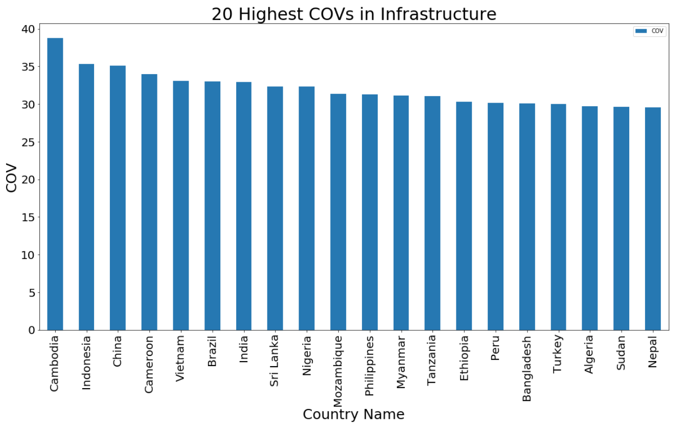
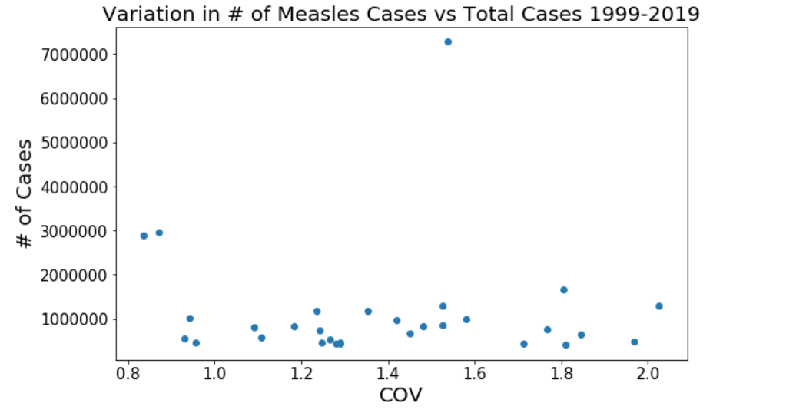
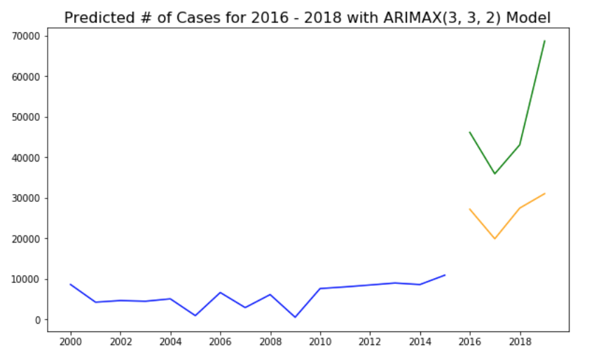
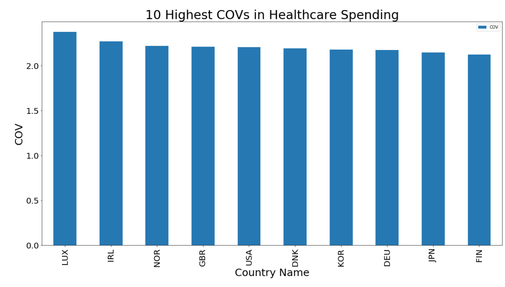
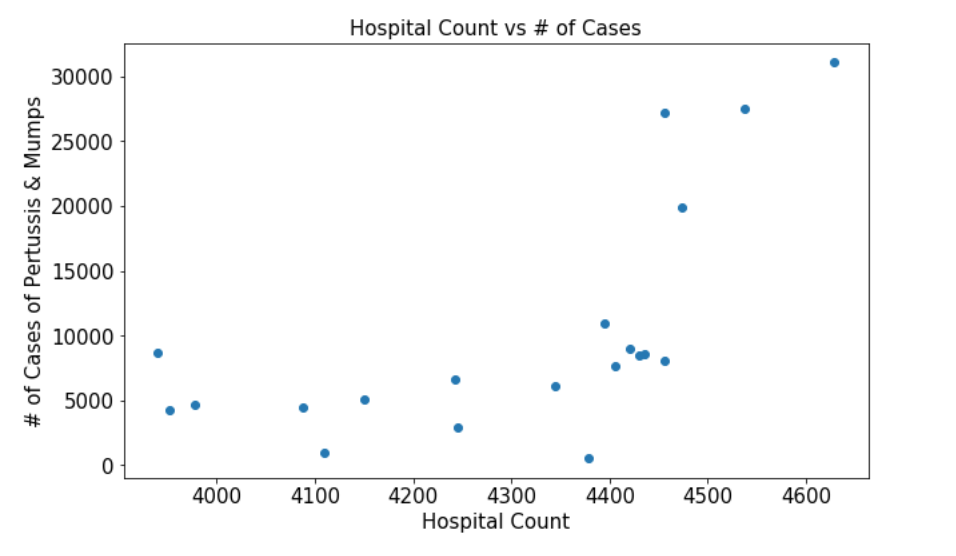
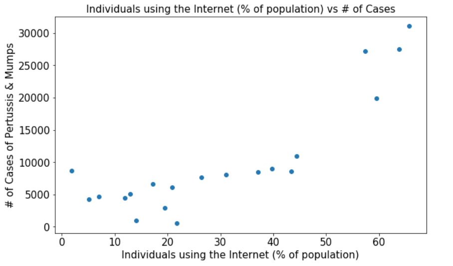
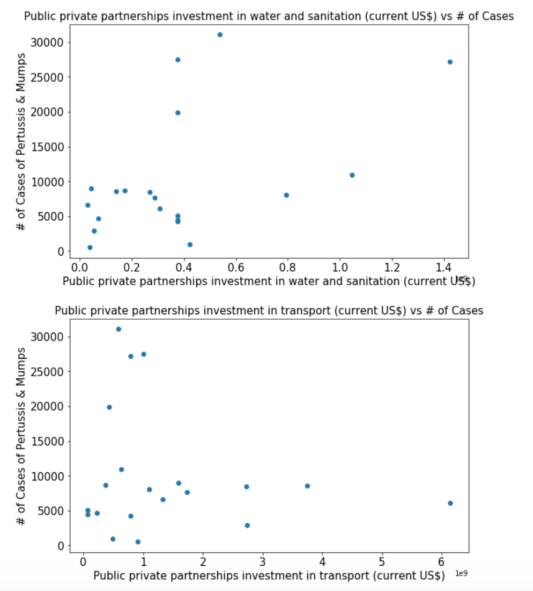

# Table of Contents
- [Problem Statement](#problem)
- [Executive Summary](#exec)
- [Success Criteria](#criteria) 
- [Data Sources](#sources)
- [Country Selection](#country)
- [Modeling](#model)
- [Analysis & Findings](#find)
- [Limitations](#risks)
- [Next Steps](#next)

# *Using Infrastructure to Predict the Spread of Viral Diseases*

## Problem Statement
The goal of this project is to try and forecast transmission rates of viral diseases based on the infrastructure of a country. 'Infrastructure' will include any indicators/metrics that may have an impact on diseases transmission. This can include metrics on transportation, sanitation, healthcare, food/drug standards, government structure, telecommunication, public health funding, etc. Within each of their categories there are a multitude of sub-indicators, for example healthcare has many indicators such as money spent on lab testing, hospital capacity, number of patients per doctor, cost of medicine, etc. These many indicators will be used to predict the number of cases for a disease for the following year. The diseases for which we are collecting data are Malaria, Cholera, Measles, Mumps, Rubella, Tuberculosis, Tetanus, and Pertussis. Many of these diseases have been eradicated and almost never show up in 1st world countries but still show outbreaks in many developing countries.

## Executive Summary

This project specifically focused on countries that show a significant amount of variation within the data using the coeffecient of variation (COV) for the number of reported cases for several diseases from 1999-2019. COV was also used to compare volatility of infrastructure between countries from 1999-2019. The reason for this is to discover possible novel relationships in developing countries between infrastructure and their transmission rates. We cannot see the effect of infrastructure inputs on transmission rates if the country has very stable infrastructure and number of cases. Countries that are extremely underdeveloped or extremely developed will generally produce overgeneralized results as their infrastructure and transmission rates are relatively stable. I.e., there is nothing novel about saying rich countries have a consistently low number of cases for a disease and poor countries have a consistently high number of cases for a disease. 

For this problem we built a time series model as we are studying the effects on spread of a disease over time given changing inputs or exogenous factors. For this reason we used an ARIMAX time series model. We gathered infrastructure data as well as transmission rate data for several diseases over time and selected features intuitively and by studying interactions and relations between variables.

## Success Criteria

The success of our model will be based on how well the model predicts the number of cases for a given year. We can guage how well the model predicts by looking at the RMSE compared to that of our baseline which is the mean of Total Cases. We will run our model on our test data to see how well our predictions match the actual number of cases. 

Additionally we aimed to find relations between inputs that provide insight into which infrastructure inputs affect disease transmission rates versus which inputs do not to assess the validity of our hypothesis and direct future projects. It could be that infrastructure does not have an effect on the spread of communicable diseases.

## Data Sources

**Infrastructure Data Sources:**

* World Health Organization (WHO)
* World Bank Group
* Statista
* Organisation for Economic Co-operation and Development (OECD)

|Disease Datasets| Description|
|---|---|
|File name & Link| Source & Description|
|[Zika](https://data.world/data-society/zika-virus-epidemic)| data.world|
|[Ebola](https://data.world/brianray/ebola-cases)| data.world|
|[Tuberculosis](http://apps.who.int/gho/data/node.main.1320?lang=en)| World Health Organization (WHO)|
|[Cholera](http://apps.who.int/gho/data/node.main.175?lang=en)| World Health Organization (WHO)|
|[Malaria](http://apps.who.int/gho/data/node.main.MALARIAINCIDENCE?lang=en)| World Health Organization (WHO)|
|[Meningitis](https://apps.who.int/gho/data/node.main.181?lang=en)| World Health Organization (WHO)|
|[Mumps, Pertussis, Rubella, Tetanus](http://apps.who.int/immunization_monitoring/globalsummary/timeseries/tsincidencepertussis.html)| World Health Organization (WHO)|

|Infrastructure Datasets| Description|
|---|---|
|File name & Link| Source & Description|
|[Health Infrastructure Data](http://apps.who.int/gho/data/view.main.30000)| World Bank |
|[Country Infrastructure Data](https://data.worldbank.org/topic/infrastructure)| World Bank |
|[Pharmaceutical Spending](https://data.oecd.org/healthres/pharmaceutical-spending.htm#indicator-chart)| Organization for Economic Co-operation and Development (OECD)|
|[Doctor and Nurse Counts](https://data.oecd.org/healthres/doctors.htm#indicator-chart)| Organization for Economic Co-operation and Development (OECD)|
|[Hospital Counts & Technology](https://data.oecd.org/healtheqt/hospital-beds.htm)| Organization for Economic Co-operation and Development (OECD)|

# Criteria for Selecting a Country

Because we wanted to see how the inputs of infrastructure might affect the spread of disease it was critical to choose a country whose infrastructure had significant change over time as well as had diseases that were random in magnitude year to year. The problem addressed here concerns itself primarily with developing countries that are politically unstable which leads to infrastructure instability. To measure this we took the Coeffecient of Variation (COV) for infrastructure data and compared countries to see which ones were most volatile. As shown in the chart below most of these countries were developing countries that might not have stable governments. L

Next, we wanted to take countries that had a high number of cases with a large Coeffecient of Variation for that disease. The image below showing the relation between COV and # of measles cases shows that while most countries have around the same 20 year totals the variation year over year is very different, which means some countries have contained it, while others still have spikes and outbreaks. This was consistent for all diseases.

The country we selected for modelling was **Mexico** because of the following disease and infrastructure metrics:

- Infrastructure COV of 26 which was relatively high considering the worldwide range of 2 to 33.
- Medical Technology COV which was the highest worlwide.
- Third highest hospital count COV worldwide.
- Relatively high COV for medical expenditure relative to other countries at 1.3 with the highest value being 2.3.

We are choosing to study transmission cases for the following diseases because Mexico showed a high COV relative to other countries as well as having a high number of cases.

- Mumps
- Pertussis

# Modeling

Given the time series data and presence of exogenous variables, we fit an Arimax model with an order of (3,3,2). This model uses the variables listed below to predict the number of Pertussis and Mumps cases within Mexico.

### Predictions

**Baseline**: 10145 (Mean of Total Cases) 
**Predictions RMSE**: 23867

### Coeffecients on Features

For every unit change in the feature the number of cases goes up or down the associated coeffecient.

|  Feature	| Coeffecient (Rounded to Whole Number)|
|---	|---	|
|  ICT Goods exports (% of total goods exports)	| -1249|
|  Individuals Using the Internet (% of population)	| 1362|
| Fixed telephone subscriptions (per 100 people) 	| 2839|
| Air transport, freign (million ton-km) 	| -20|
| Industrial design applications, nonresident, by count 	| -25|
|  Public private partnerships investment in water and sanitation (1 Million US Dollars) 	| 6|
|  Public private partnerships investment in transport (1 Million US Dollars)	| .03|
|  Electricity production from natural gas sources (% of total)	| -15|
|  ICT service exports (% of service exports, BoP)	| 4341|
|  Healthcare Expenditure Percent GDP	| 2566|
| Pharmaceutical Spending US $ / Capita 	| -65|
| CT Scan Device Counts  	| -68|
| PET Scan Device Counts  	| -1143|
| Doctors per 1000 People  	| 256|
| Nurses per 1000 People 	| -19|
| Hospital Count  	| 22|

# Analysis & Findings

Although it was expected that we wouldn't be able to test our model to a significant extent, we did observe some relationships that will help direct further projects and models. Some noteworth relationships are shown below

The first interesting relationship is that while developing and third world countries typically have the highest non-healthcare infrastructure variation, many 1st world countries have high variation for healthcare. This is likely because one of the things that makes a country 'developed' is having a robust medical system. These countries likely devote and reinvest a significant portion of their money every year into improving healthcare whereas many developing countries do not have the means to therefore their healthcare budgets stay roughly the same year to year.

Diving into relationships observed within Mexico, interestingly as the number of hospitals increases the number of cases increases. This observation has led me to rethink how we tackle public health policies moving forward. I cannot assume causal relationships because the collection of data is something to take into consideration. With more hospitals the more cases will be reported which is one aspect we did not consider. Also, it is possible that in developing countries, infrastructure is more reactionary than preparatory. Meaning, because of limited resources they do not increase spending on healthcare unless they have to. So as disease increases so does the number of hospitals, doctors, medical tech, etc which was something also observed by looking at the coeffecients above. 

Another interesting observation was that as the number of people on the internet increased so did the number of cases. While I thought better access to information might limit the spread of disease because people could be better informed, have more knowledge on prevention and how to treat things, the opposite proved true. While this relationship might just be coincidental, it does raise an interesting question that we could examine further, how by having a more 'social' society can affect the spread of disease compared to rural settings.

The last thing that was very interesting was that the more money spent on sanitation and transportation the more disease there was. Transportation might be obvious because as more people commute the easier a disease spreads compared to areas with no rail lines, buses, or available walkways. Sanitation however offers an unusual relationship as one would expect there to be an inverse relationship. Again, this might offer insight as to how developing countries operate; they do not increase funding for prevention, but as a reaction to something bad happening. So it could be in fact that spending in sanitation increases after the nubmer of diseases spikes.

# Limitations

The risk and pitfall of this model is that infrastructure data is only available and updated once every year and likely only shows a significant effect on society year to year which means we have a limited subset of data. Also the fact that many countries have only started reporting infrastructure and health data in the last 2 decades limits the scope of our model. The fact that many politically unstable countries also do not report data on many of the metrics we selected limits the pool of countries that we can produce a model for. The lack of granularity in data will limit the accuracy of our predictions as we are limited to only 20 data points from 1999-2019. 

# Conclusions & Next Steps
Differencing at an order of 3 is not ideal however was required based on our AD Fuller test. For the next step we will most likely use a Vector Autoregression Model (VAR) for this data. 

Additionally the hypothesis likely needs to be modified based on observed relations between infrastrcture and viral cases and through observing the coeffecients on our model. Our original hypothesis was based on the theory that countries with increasing levels of infrastructure are able to handle the spread of disease better through access to more to information, better sanitation, more medicine, more hospitals, and more doctors. This theory appears to be false but can lead to further studies on each individual aspects of infrastructure within Mexico. The next best route would be to focus on one area of infrastructure such as transportation, communication, healthcare, etc. The reason being is that as shown above these different pieces of infrastructure do not always have the same relationship with the number of viral cases as expected. Some things that one would consider 'good' for infrastructure are actually bad in terms of contributing to the spread of diseases. Additionally we would have to look at causal relationships between infrastructure and disease spread by taking a closer look at how a country designates a budget. For example, as discussed before, in first world countries it may be a natural course of action to increase spending on medical services regardless of outbreaks, however in developing countries with limited resources they may not be able to, thus funding medical services actually follows an outbreak. Tackling a problem like this requires more than just data but really learning the ins and outs of a country, how it operates, how government leaders make decisions, how the country reports statistics, etc. While the results of the model may not have provided much predictive power it does offer direction of which areas to focus on in the future.
